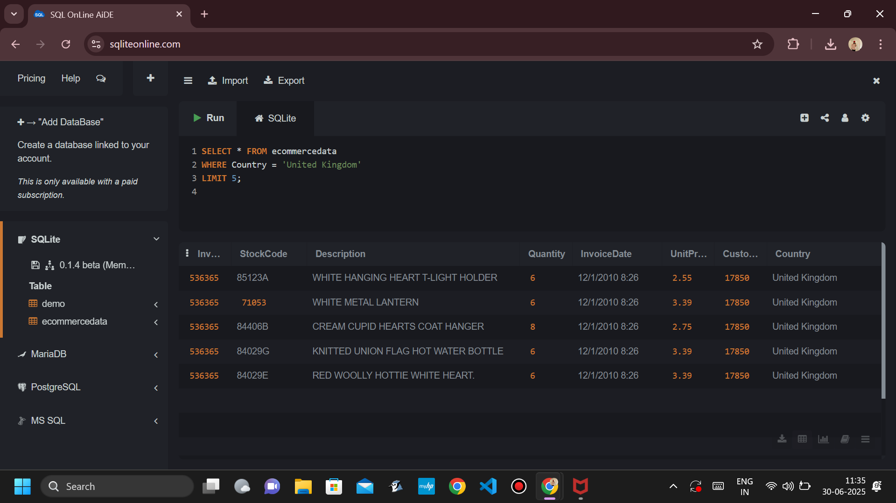
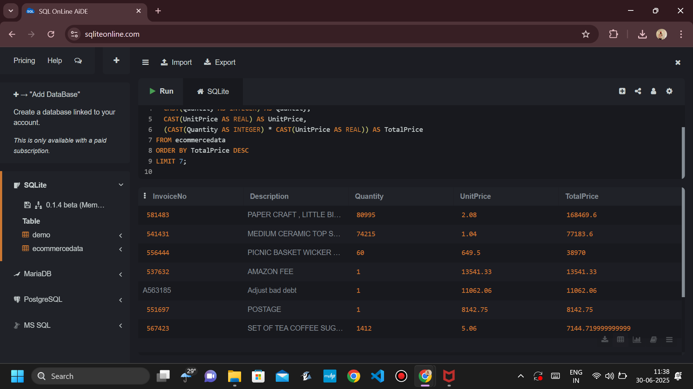
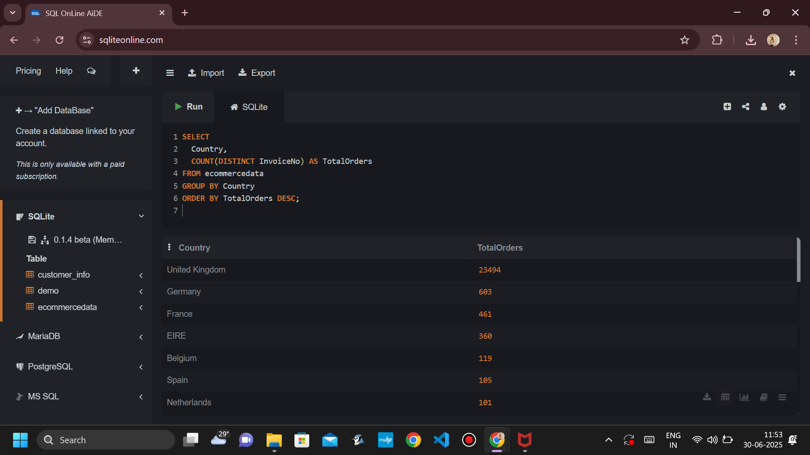
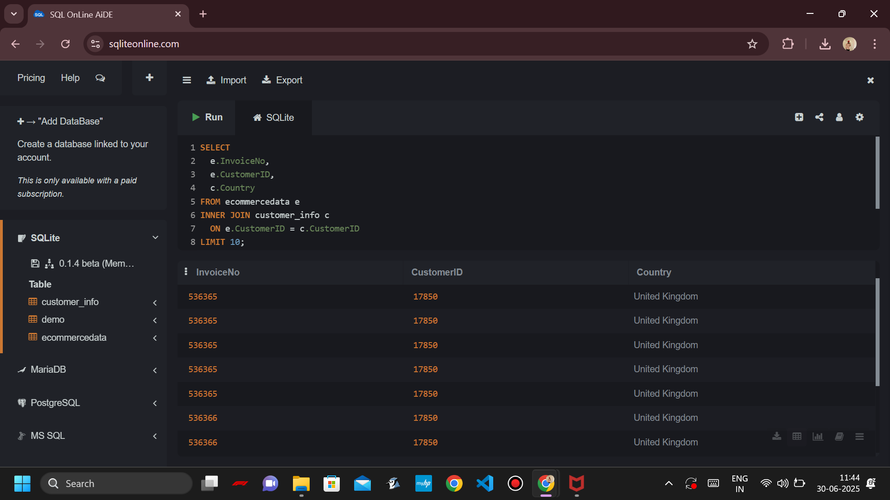
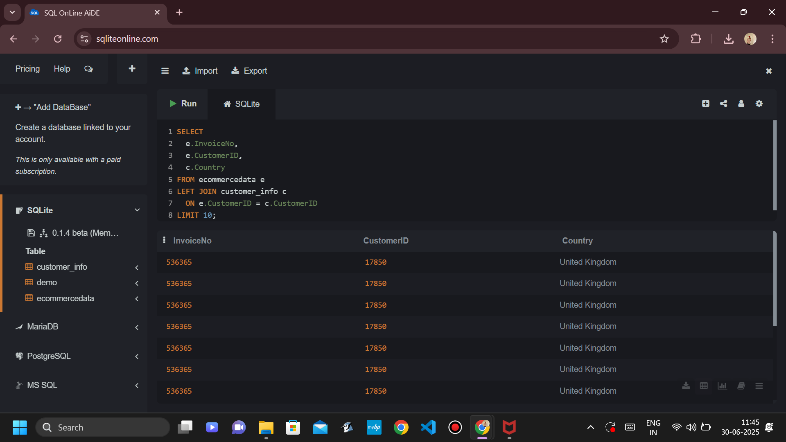
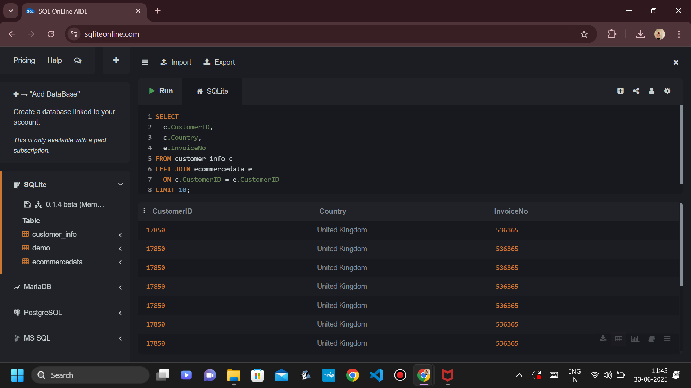
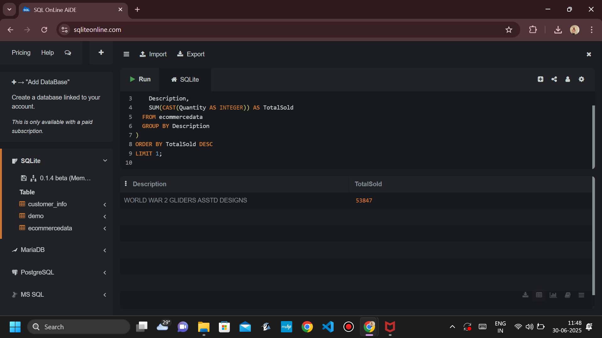
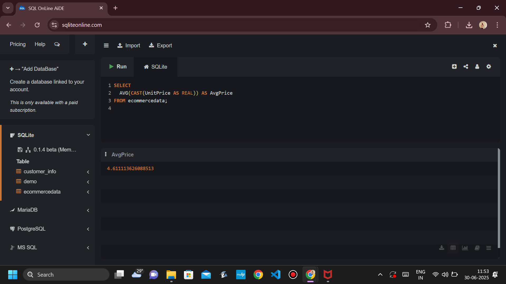
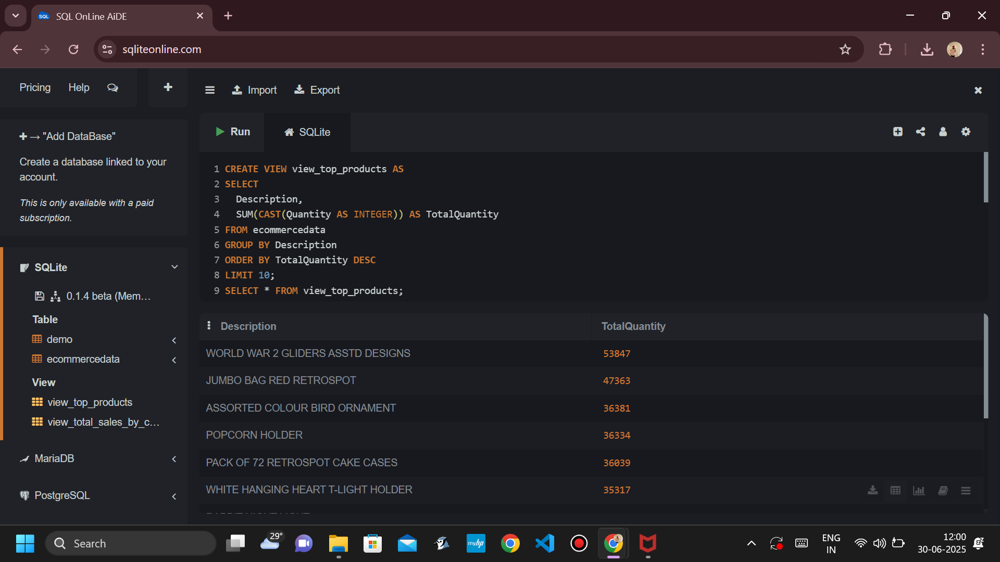
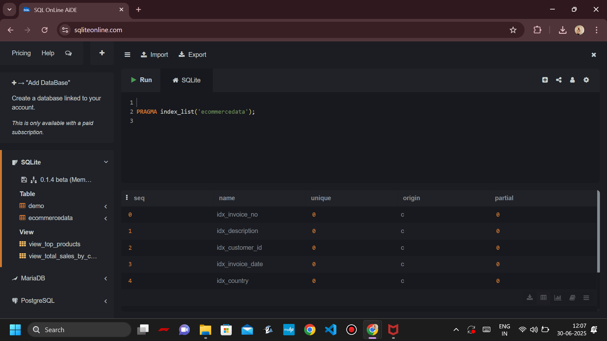

# 🛒 Task 4: SQL for Data Analysis (Ecommerce Dataset)

## Dataset
[Ecommerce Data from Kaggle](https://www.kaggle.com/datasets/carrie1/ecommerce-data)

---

## Queries and Screenshots

### 1️⃣ Total Sales by Country  

### 2️⃣ Top 10 Highest Selling Products  

### 3️⃣ Total Sales by Region  

### 4️⃣ INNER JOIN: Invoice Info with Customer  

### 5️⃣ LEFT JOIN: Customers with or without Orders  

### 6️⃣ RIGHT JOIN (Simulated via LEFT JOIN)  

### 7️⃣ Subquery: Product with Maximum Quantity Sold  

### 8️⃣ Average Unit Price  

### 9️⃣ Create View: Sales by Country  

### 🔟 Create Indexes for Optimization  

---

## 👤 Author
**Parampreet Singh Ahluwalia**  
🔗 LinkedIn: [https://www.linkedin.com/in/YOUR_USERNAME](https://www.linkedin.com/in/parampreet-singh-ahluwalia-0704582b1/))

---

## 🗂 Folder Structure
